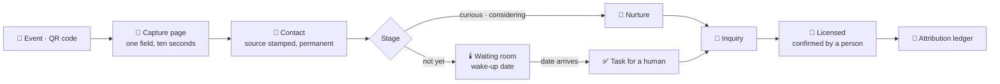

<div align="center">

# 🏡 Porchlight

**Recruitment for the stage nobody sees.**

Capture people at the church fair before they vanish. Hold *"not yet"* gently, for years.
Trace every licensed home back to the Saturday it started.

[**porchlightfostercare.org →**](https://porchlightfostercare.org)

[](https://nextjs.org)
[](https://www.typescriptlang.org)
[](https://supabase.com)
[](#verification)

</div>

---

## The problem

Arizona is running out of foster homes, and the decline is not slowing.

| | |
|---:|:--- |
| **4,875 → 1,859** | licensed foster homes, SFY17 → SFY25 — a **61.9% collapse** <sup>[1]</sup> |
| **1,046** | additional homes the state says it needs, within twelve months <sup>[2]</sup> |
| **8,183** | children in out-of-home care <sup>[3]</sup> |
| **17.2%** | of care days now spent in congregate care — **rising**, against the Department's own goal of a two-point cut <sup>[1]</sup> |

Agencies are judged on licensed homes. But every tool they own — Binti, Casebook, CCWIS — starts at the **application**. Everything before it is a shoebox of business cards and a recruiter's memory.

That upstream ground is unowned. A person who says *"maybe in a few years"* is not a failure; they are a home that arrives in 2029, if anybody remembers to keep the light on.

## What Porchlight does

Four things no licensing system does, because none of them can see this far up the funnel.

| | |
|---|---|
| 🔦 **Capture** | One field, ten seconds. A QR code on a table becomes a contact with its source stamped on, permanently. |
| 🕯️ **Waiting room** | `not_yet` is a first-class status with a wake-up date, not a rejection. The date lives in the database, so it survives every deploy. |
| 💌 **Nurture** | Stage-keyed email, never calendar-blasted. One human reply pauses the machine. |
| 📒 **Ledger** | Cost per licensed home, by source, across a 12–24 month lag. The screen that closes the sale. |



Plus an **Arizona dashboard** where every public figure carries its publisher, link and as-of date — and where a grain the state doesn't publish is *said out loud* rather than left blank.

## The rules the code enforces

Product invariants live in Postgres, not in app code. The schema is the spec — these survive every future bug and every future contributor.

- **No orphan contacts, ever.** `contact.source_id` is `NOT NULL` and immutable by trigger. Attribution cannot be rewritten after the fact.
- **History is append-only.** `stage_change` and `touch` reject `UPDATE`. Stages move only through `set_contact_stage()`.
- **…with exactly one audited way out.** Erasure flows through `delete_contact()`, because "append-only" quietly meant "undeletable", and a product holding a stranger's PII must be able to answer *"please delete my information."*
- **Consent is checked at the send layer**, the single path to the email provider. Opt-out is irreversible by trigger. Double-fired crons send once.
- **Public statistics are unwritable.** `az_stat` has a read policy and *no write policy at all* — only the import script's service-role key can put a number there. An agency's goal and a state figure live in physically separate tables, so one can never be mistaken for the other.
- **Every table is agency-scoped with RLS**, and it's tested rather than assumed.

## Deliberately not built

Home-study workflow · case management · anything touching child data · a caregiver-facing family app · group-home compliance.

Porchlight hands off at the inquiry and never becomes the system of record. **CSV contact import is refused on purpose** — a list with no record of how those people were reached is the one feature that would turn this into the thing it exists to replace.

## Verification

Nothing here is assumed. Every suite runs against a real Supabase project with real authenticated users.

```bash
node scripts/smoke-test.mjs .env.local   # 59 assertions — invariants, RLS isolation, erasure
node scripts/cron-test.mjs  .env.local   # 10 — wake-ups, cold flags, once-only sends
node scripts/anon-audit.mjs .env.local   # 35 — what a stranger with the public key can reach
node scripts/demo-test.mjs  .env.local   # 5  — demo tenancy guards
```

`anon-audit` has caught two real security holes that nothing else would have — once an anonymous erasure RPC, once a globally-readable table. Run it after **any** migration that adds a function or a policy.

## Setup

1. **Supabase** — create a project, then run every file in `supabase/migrations/` in numeric order, `0001` → `0011` (or `supabase db push`). Forward-only and not idempotent: run each exactly once.
2. **Env** — copy `.env.example` to `.env.local` and fill in the Supabase URL, anon key and service-role key. `RESEND_API_KEY`/`EMAIL_FROM` are only needed for nurture email; `CRON_SECRET`/`INBOUND_WEBHOOK_SECRET` guard the system endpoints.
3. `npm install && npm run dev`
4. Sign in with a magic link, create your agency at `/onboarding`, create an event at `/events`, scan the QR code.
5. **Arizona county data** *(optional)* — `/arizona` ships with headline figures seeded by migration 0007. For county-level data, download the two DCS workbooks into `az_docs/` and run `node scripts/az-stats-import.mjs --apply`. See [docs/az-data-sources.md](docs/az-data-sources.md) — `dcs.az.gov` returns 403 to every server-side fetcher, so a human with a browser is part of the pipeline.

Deploying it for real? [docs/deploy-setup.md](docs/deploy-setup.md) covers Vercel, DNS and the Supabase auth URLs that have to agree with both.

## System endpoints

- `GET /api/cron/tick` — daily Vercel cron, `Bearer CRON_SECRET`. Wake-ups, stage-keyed nurture, quarterly `not_yet` cadence, cold flags.
- `POST /api/webhooks/inbound` — `x-webhook-secret`. Inbound reply → pause automation, log the touch, create a task.
- `/c/[slug]` public capture · `/u/[id]` one-click unsubscribe.

## Documentation

| | |
|---|---|
| [docs/PLAN.md](docs/PLAN.md) | The milestone plan, M0 → M5 |
| [docs/ai/decisions.md](docs/ai/decisions.md) | ADRs — **read before changing schema or send paths** |
| [docs/ai/architecture.md](docs/ai/architecture.md) | System design |
| [docs/ai/memory.md](docs/ai/memory.md) | What was built, and what it taught us |
| [docs/az-data-sources.md](docs/az-data-sources.md) | DCS workbook inventory and parsing traps |
| [docs/deploy-setup.md](docs/deploy-setup.md) | Production runbook |

## Stack

Next.js 16.2 (App Router) · TypeScript · Tailwind v4 · Supabase (Postgres + RLS + Auth) · Resend · Vercel.
One deployable, one database, one daily cron. No queue, no workers, no second service.

---

<sup>[1]</sup> Arizona DCS, [Monthly Operational & Outcomes Report, June 2026](https://dcs.az.gov/content/monthly-operational-outcomes-report-june-2026).
<sup>[2]</sup> Governor's Office via KJZZ, [*Arizona just raised foster care pay rates by 50%. State still needs 1,046 more homes*](https://www.kjzz.org/politics/2025-12-05/arizona-just-raised-foster-care-pay-rates-by-50-state-still-needs-1-046-more-homes), 5 Dec 2025.
<sup>[3]</sup> Arizona DCS, [Semi-Annual Child Welfare Report, March 2026](https://dcs.az.gov/content/semi-annual-child-welfare-report-mar-2026) — as of 31 Dec 2025.
