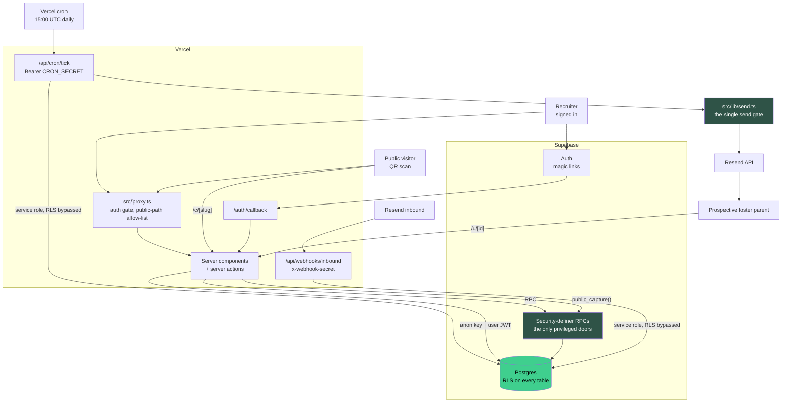
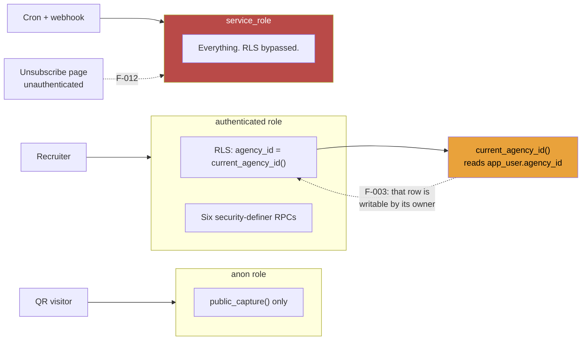
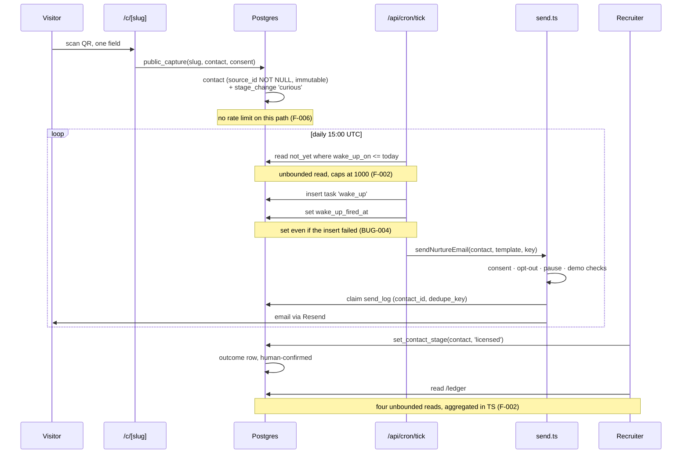

# Architecture and Implementation

An auditor's read of the system as built, at `980985b`. This complements
`docs/ai/architecture.md`, which is the maintainer's own design document and is
accurate. Where this file differs, it is because an audit reads for where the shape
will bite the next change rather than for how it was intended.

---

## 1. System overview

One Next.js 16.2 deployable on Vercel, one Supabase Postgres, one daily cron. No
queue, no workers, no cache, no object store, no second service. For a pilot-scale
multi-tenant CRM this is the right amount of machinery, and the discipline of it
shows: 8 production dependencies and 442 packages installed in total.

**The two things the diagram is really saying.** Every write that matters funnels
through a named choke point: `public_capture()`, `set_contact_stage()`,
`quick_add_contact()`, `delete_contact()`, `create_agency()`, `accept_invite()` on
the database side, and `sendNurtureEmail()` on the provider side. And the
service-role client, which bypasses all of it, is reachable from four places, three
of which are behind shared secrets. The fourth is `/u/[id]`, which is open to the
internet (F-012).

## 2. Trust boundaries

Three roles, cleanly separated, with two dotted lines that should not be there.
Both are findings, and both are small fixes.

The `anon` surface is unusually well managed. ADR-007's follow-up records the rule
that Supabase grants EXECUTE on every new public-schema function to `anon`
automatically and that `revoke ... from public` does not undo it, so every function
must be revoked by name. `scripts/anon-audit.mjs` checks it, and migration 0010
exists because the audit caught a violation. That is a control that has demonstrably
worked twice.

## 3. Capture-to-ledger flow

## 4. Third-party inventory

| Service | What it holds or sees | Boundary | Notes |
|---|---|---|---|
| **Supabase** (Postgres, Auth, PostgREST) | Everything. Contact names, emails, phones, notes, stage history, agency records | Anon key is public by design and safe only because RLS is on. Service-role key bypasses RLS entirely | Sole data store. ADR-001 accepts the lock-in deliberately |
| **Resend** | Recipient address, first name, subject and body of every nurture email; inbound reply bodies | Single gate at `src/lib/send.ts`. Not yet live: no email has ever been sent | Processes PII about prospective foster parents. A DPA and a privacy-policy mention are needed before the first real send |
| **Vercel** | Hosting, runtime logs, cron scheduling | Environment variables hold all four system secrets | `NEXT_PUBLIC_APP_URL` is inlined at build time, so a dashboard change needs a rebuild |
| **Arizona DCS workbooks** | Public statistics only, no personal data | Manual download, parsed offline by `scripts/az-stats-import.mjs` | `dcs.az.gov` returns 403 to server-side fetchers, so a human is deliberately in the loop |
| **SheetJS CDN** | Build-time only | Tarball dependency outside the npm registry | See F-015 |

No analytics, no session recording, no tag manager, no third-party fonts loaded at
runtime, no error-reporting vendor. The last of those is a gap (F-011); the rest is
a deliberate and appropriate absence for a product holding this data.

**Privacy posture.** The system holds names, emails, phone numbers and free-text
recruiter notes about identifiable adults who have expressed interest in fostering.
It holds no child data at all, by design (spec section 02, and the fence is restated
in ADR-008). Erasure is implemented and tested: `delete_contact()` removes the whole
person including append-only history, and there is a smoke test that erases a
contact mid-checklist. That is a materially better GDPR and CCPA position than most
products at this stage. The gaps are procedural rather than structural: no privacy
policy in the repository, no data-processing agreement with Resend, no documented
retention period, and no export mechanism for a subject-access request.

## 5. Walkthrough by feature

### 5.1 Authentication and session

`src/proxy.ts` runs on every non-static request, calls `supabase.auth.getUser()`,
and redirects to `/login` with a `?next=` path for anything outside the public
allow-list (`/`, `/login`, `/c/`, `/u/`, `/api/`, `/auth`). `requireUser()`
(`src/lib/auth.ts`) re-checks inside the `(app)` layout and resolves the
`app_user` row plus agency, redirecting a signed-in user with no agency to
`/onboarding`.

The `?next=` handling is correct in both places that touch it: `login/page.tsx:22`
and `auth/callback/route.ts:10` both require a leading `/` and reject `//`, which
closes the protocol-relative open-redirect that this pattern usually leaves open.
Worth noting as a thing done right, because it is commonly done wrong.

Two observations. `/api/` is exempt from the proxy on the stated grounds that the
routes guard themselves, which is true but means the guard quality in F-005 is the
whole gate. And the env-missing branch does not match its comment (F-019).

### 5.2 Public capture

`/c/[slug]` is a server component with an inline server action. One required field,
one optional name, one consent checkbox defaulted on. It builds a bare anon client
(not the cookie-aware one, correctly, since there is no session) and calls
`public_capture()`.

The database side is well built. `public_capture()` is security-definer, resolves
the agency from the slug so the caller cannot choose it, writes the `contact` and
its first `stage_change` in one transaction, and trims and nullifies empty strings.
`contact.source_id` is `NOT NULL` and immutable by trigger, so attribution cannot be
rewritten later. This is the invariant the whole ledger rests on and it is enforced
where it should be.

What is missing is everything between the internet and that RPC: no rate limit, no
honeypot, no format validation beyond `includes("@")` (F-006), on an endpoint whose
slug is roughly 20 bits of entropy (F-020). The page itself is admirably lean, which
matters because the design budget for a QR scan on mobile data is sub-second, and
commit `5536333` shows that budget being defended.

### 5.3 Stage machine and history

`contact.stage` can only move through `set_contact_stage()`, enforced by a trigger
that checks a transaction-local GUC the function sets around its own update.
`stage_change` and `touch` reject `UPDATE` and `DELETE` outright, with one exception:
`delete_contact()` sets a second GUC that the append-only trigger honors, so erasure
has exactly one audited door.

This is the strongest part of the codebase. The invariants are in Postgres, so they
survive every future code path including buggy ones, which is exactly what ADR-002
claims. The GUC pattern is non-obvious, and the ADR says so.

One historical note worth reading: the first cut of `delete_contact()` treated a
null `auth.uid()` as trusted, meaning anonymous callers could erase any contact.
Migration 0004 fixed it and the commit (`c9b2a69`) names the hole plainly. The
lesson generalized into a rule (revoke every new function from `anon` by name) and
then into a test (`anon-audit.mjs`). That is the right sequence, and it is the
single best signal in this repository about how it is maintained.

### 5.4 The send layer

`src/lib/send.ts` is the only path to Resend. Consent, opt-out, pause and demo-tenant
checks all live there rather than in callers, and the `send_log` dedupe key is
claimed before the provider call so a double-fired cron sends once. The claim is
released on failure, so a transient outage retries next tick rather than silently
dropping the message. The demo block fails closed: if `is_demo` cannot be determined
it assumes true and refuses to send.

Every one of those decisions is right, and each has a recorded reason (ADR-004,
ADR-010). The structural criticism is in F-014: the layer is channel-specific at
every seam while ADR-003 records it as channel-agnostic, which will mislead whoever
plans the SMS work.

### 5.5 The cron

One route, five phases, running as service-role across every tenant. Wake-ups,
stage-keyed nurture (one email per contact per tick, deliberately), quarterly
`not_yet` cadence, 30-day cold flags, monthly outcome-confirmation prompts.

Everything is driven by dates in the database rather than in-process state, so the
tick is re-runnable and survives deploys. That is a good design for a single-cron
product.

Three implementation issues cluster here: the unbounded reads (F-002), the discarded
insert error on the wake-up path (BUG-004), and the missing dedupe key on cold flags
(BUG-005). There is also an N+1 pattern (a `stage_change` query per nurturable
contact at line 86, a `touch` query per considering contact at line 152), which is
fine at pilot scale and is the same threshold the ledger will hit first.

### 5.6 Tenancy and joining

`current_agency_id()` reads one column of one row, and every RLS policy is written
against it. Joining is two security-definer RPCs, `create_agency()` and
`accept_invite()`, added in migration 0009 to remove the service-role client that
used to live in the onboarding request handler (ADR-012).

The invite design is careful in a way worth calling out: the token alone is not
sufficient, because `accept_invite()` requires the signed-in address to match the
invited one, so a forwarded link cannot be used to walk into someone else's tenant.
And since the invitee has no agency yet, RLS hides `agency_invite` from them
entirely, which is why `invite_preview()` exists and why it returns only a name.

The gap is F-003: the one row that decides tenancy is writable by the user it
describes.

### 5.7 The ledger

`/ledger` reads four tables and aggregates in TypeScript: captured, still warm,
inquiries, licensed, median lag from capture to license, cost and hours per home,
plus the waiting-room yield callout. The economics are honest, in that the source's
cost survives contact erasure so denominators stay stable (ADR-007), and licensing
is human-confirmed rather than inferred (ADR-005).

It is also the page most exposed to F-002, and the one where wrong numbers cost the
most.

### 5.8 Arizona dashboard

`az_stat` has a select policy and no write policy at all, so only the import
script's service-role key can put a number there. Agency goals live in a physically
separate `agency_target` table rather than behind a boolean flag. The `Cited`
component takes a required `source: Citation` prop, so there is no code path that
renders a public figure without its provenance.

This is a well-argued piece of design (ADR-009, ADR-011) and it is enforced
structurally rather than by convention. Migration 0010 is the one place it slipped,
where a policy without a `to authenticated` clause made the requirement catalog
readable by anyone holding the anon key, and the anon audit caught it.

## 6. Design and abstraction read

Where the current shape will resist the next change.

| Seam | Shape today | Holds for | Pressure point |
|---|---|---|---|
| Privileged DB access | `createAdminClient()`, a bare factory with no scoping and no policy about who may call it | Two system endpoints | Already leaked into a public route (F-012). The rule that was supposed to prevent this is stated as a string check |
| Tenant resolution | One SQL function reading one writable column | Everything | Single layer with no application-side backstop (F-013), and the column is user-writable (F-003) |
| Message sending | One function, email-shaped throughout, documented as channel-agnostic | Email | SMS is on the roadmap and the seam it assumes does not exist (F-014) |
| Aggregation | TypeScript over full-table reads | Under 1,000 rows per tenant | Silently wrong past the cap (F-002), not merely slow |
| Server-action inputs | `String(formData.get(...))` with no schema | Current forms | No validation library; the RPCs carry the real checks, which is consistent, but the capture path accepts any string as an email |

The counts matter for the first three. `createAdminClient` has four call sites, so
narrowing it is a contained change today. `sendNurtureEmail` has two call sites and
one type, so building the channel seam is contained today. Both get more expensive
with every feature added, and both are cheapest to do before the work that will
depend on them (the unsubscribe rework in F-004, and the Twilio registration in the
roadmap).

## 7. In-flight plans, evaluated

Per the method, a plan is evaluated rather than merely logged. The repository holds
one milestone plan (`docs/PLAN.md`), a roadmap, a task list, and eleven ADRs. There
is no separate design document proposing a new abstraction, so the evaluation
targets the forward items that imply one.

**ADR-003, the channel-agnostic send layer, is the one plan that does not hold.**
The decision names the alternative it rejected (blocking the pilot on Twilio A2P
registration) and chose correctly. What it overstates is the consequence: the layer
it describes as channel-agnostic is email-specific in its name, its consent check,
its provider construction, two hardcoded `channel` literals, its transport headers
and its `Template` type. Adding SMS therefore costs building the seam, not dropping
in a provider. Flagged as F-014 with a concrete refactor. The deep design work
belongs to a focused session rather than to this audit.

**The remaining forward items are confirmed rather than flagged:**

- *Ledger to a SQL view past 1,000 contacts* (`tasks.md:64`). The right destination,
  reached for the wrong reason. It is filed as performance debt; F-002 shows the
  actual failure is silent under-counting, which changes its priority from "later"
  to "before the pilot grows".
- *Suites into CI, blocked on a throwaway Supabase project* (`tasks.md:37`). Correct
  diagnosis and correct blocker. F-008 adds that four of the five gates (typecheck,
  lint, build, audit) need no database and can land immediately.
- *Email the invitation instead of copying a link* (`roadmap.md:36`). Well scoped.
  Note it will route through `send.ts`, which currently assumes a `NurtureContact`
  with consent columns; an invite has no consent record and no `contact_id` for the
  dedupe key, so this feature will meet F-014's seam problem before SMS does.
- *Playwright e2e plus a throttled-3G check on the capture page* (`tasks.md:36`).
  Correct priority. The capture page is the one screen with a sub-second budget.

## 8. Verification plan

What this audit ran, and what a follow-up should run.

**Executed here (VERIFIED):**

| Command | Result |
|---|---|
| `npx tsc --noEmit` | Exit 0, clean, strict mode on |
| `npm run lint` | Exit 0, 0 errors, 86 warnings all in `scripts/` |
| `npm run build` | Exit 0, 24 routes, roughly 25 seconds, no warnings |
| `npm audit` | 12 high, 0 critical/moderate/low |
| `npm outdated` | Three major gaps, patch available for `next` |
| Git history, all refs | 34 commits, no force-push, no secrets ever committed |

**Not executed, with the reason:**

| Check | Why not | How to close |
|---|---|---|
| The five verification suites | Need live service-role credentials and create and destroy real records | Run against the throwaway Supabase project once it exists (F-008) |
| RLS policy behavior | No database was touched | Same |
| F-003 privilege escalation | Needs a live session | Two SQL statements as a signed-in test user: set `agency_id`, set `role`. Both must fail |
| F-002 row cap | Needs a tenant over 1,000 contacts | Seed 1,200 contacts in the throwaway project, load `/ledger`, compare against a `count(*)` |
| F-004 scanner unsubscribe | No email has ever been sent | Send one test message to a scanned mailbox and check whether `opted_out_at` is set before it is opened |
| Bundle sizes | Turbopack does not print per-route First Load JS | Run `next build` with the webpack builder once, or use `@next/bundle-analyzer` |
| Vercel environment scoping | Dashboard not inspected | Confirm which environments carry `CRON_SECRET`, and whether preview deploys point at the production database (F-005) |
| Capture page on mobile data | Needs a physical device | Already item 1 in `docs/ai/tasks.md`: scan a printed QR from a phone |

---
generated_by: codebase-audit skill v1.1
generated_on: 2026-07-26
project: C:\Users\Perry\Dropbox\PC\Documents\GitHub\Foster-Care
project_type: node
verification: full
---
