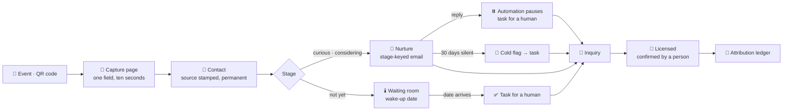

# How Porchlight works, end to end

*The operational companion to [overview.md](overview.md). This document names who does what, in order. For a new recruiter's day-one guide, read [training.md](training.md).*

---

## The stage model

Everything in Porchlight hangs off seven stages:

```
unaware → curious → considering → not yet → inquiry → licensed
                                                    ↘ declined
```

| Stage | What it means |
|---|---|
| **Unaware** | They are in a pew, a break room, a neighborhood group. Fostering has not crossed their mind. You are recording the places you showed up. |
| **Curious** | They stopped at your table. They gave you a way to reach them. |
| **Considering** | They are actually weighing it. This is where the eligibility and cost questions live. |
| **Not yet** | *"Ask me in two years."* A promise with a date on it. |
| **Inquiry** | They raised their hand. Hand them to licensing. |
| **Licensed** | A home. Confirmed by a person, never by the software. |
| **Declined** | They told you no. |

Four things about this model are load-bearing:

1. **"Not yet" is a parallel holding lane, not a rejection.** On the board it sits between *considering* and *inquiry* precisely so nobody reads it as the end of the line. People leave it in both directions, and the ones who come back are among the best homes you will ever license.
2. **Every stage move is written to append-only history.** You can see when somebody moved, and to what. Nobody can quietly rewrite it later.
3. **Entering "not yet" always sets a wake-up date.** If you do not choose one, it defaults to a year out — because nobody should sit in the waiting room without a clock.
4. **Leaving "not yet" clears the clock.** A family who comes back and then says "not yet" again gets a fresh date, not a stale one.

The board (`/board`) shows five lanes — Curious, Considering, Not yet, Inquiry, Licensed. *Unaware* and *Declined* are real stages but not working lanes. Every card has a stage dropdown; choosing **Not yet** opens a *"Check back on"* date inline that you cannot dismiss, because a held contact without a date is a forgotten person.



---

## The workflow, step by step

### 1. Create the agency — *director*

Sign in at `/login`. There is no password; Porchlight emails you a magic link. First time in, `/onboarding` asks for your agency's name. Creating it makes you its **director**.

### 2. Invite the team — *director*

`/settings/team` → invite by email address, choose recruiter or director.

**Porchlight does not send the invitation email.** It gives you a link, and you copy it into whatever you already use. The invitee opens the link, signs in with the address you invited, and lands inside your agency. Invitations expire after fourteen days, and the email on the invitation has to match the address they sign in with.

### 3. Create the source — *recruiter*

Before you go anywhere, create the thing you are about to attend at `/events`: name, kind (event, ambassador, digital, partner or walk-in), date, location, **what it cost you**, and **how many hours it will take**.

Those last two are not admin busywork — they are the denominators in the ledger. An event with a blank cost looks free forever, and a free event that produces nothing will never be recognisable as a waste of a Saturday.

### 4. Get the QR code — *recruiter*

Open the source at `/events/[id]`. It renders a QR code pointing at that source's public capture page. Print it, tape it to the tablecloth, or just hold up your phone.

### 5. Capture people — *the family, or the recruiter*

Three ways in, and every one of them demands a source:

- **The public page** (`/c/[slug]`) — what the QR opens. One field: a phone number *or* an email. Name second. A consent checkbox. It does not read the database when it loads, because it has to be instant on a bad fairground connection. Submitting creates the contact at stage **curious**, with the source stamped on permanently.
- **Quick-add on the event page** — for the person who will not scan anything. You type it yourself; it is about eight seconds.
- **`/contacts/new`** — for somebody you met away from a table. It still requires a source, and lets you create one inline. There is deliberately no catch-all "direct" bucket.

### 6. The nightly job runs — *the machine*

Once a day at 15:00 UTC, Porchlight does five things. All of them are driven by dates in the database, so the job is safe to re-run and survives every deploy.

| | What it does |
|---|---|
| **Wake-ups** | Anyone in *not yet* whose date has arrived becomes a task for a human. It fires once, ever. |
| **Nurture** | *Curious* and *considering* contacts who consented to email get the next note whose waiting period has elapsed since they entered that stage. **One email per contact per run** — warmth, not a flood. |
| **Quarterly cadence** | One quiet note to the waiting room roughly every ninety days. |
| **Cold flags** | Anyone in *considering* with no contact at all for thirty days becomes a task. One open flag at a time. |
| **Outcome confirmation** | Once a month, if families you captured sixty-plus days ago are still sitting at *inquiry* with no outcome recorded, you get a task: *"Any of them licensed yet?"* |

Every automated email passes through one gate, and it fails closed: no consent, no send; opted out, no send; a live human conversation in progress, no send; no email provider configured, no send; a demo agency, no send. The key that marks an email as sent is claimed *before* sending and released if sending fails — so a cron that fires twice sends once, and a provider outage retries tomorrow instead of silently swallowing the email.

Every send is logged as a conversation on the contact's timeline, so what the machine said is visible next to what you said.

### 7. Somebody replies — *the family, then a recruiter*

An inbound reply does three things at once: **automation pauses for that person**, the reply is logged on their timeline, and a task appears.

Nothing un-pauses automatically. A recruiter resumes it deliberately from the contact page, or leaves it paused forever. That is the intended behaviour — a person mid-conversation with you should never receive a scheduled email.

### 8. Work the queue — *recruiter*

`/tasks` holds everything waiting on a human: wake-ups, replies, cold flags, monthly outcome checks. The dashboard shows the top five under *"What needs you today."*

This is the daily habit the whole product rests on. The nightly job cannot make a phone call.

### 9. They inquire — *recruiter*

Move them to **inquiry** and hand them to your licensing team.

Optionally, start the onboarding checklist. It ships with the nine Arizona requirements — 21 or older, Level 1 fingerprint clearance card, FBI and local background checks, three computer-based trainings, ten instructor-led webinars, all training inside eight weeks, medical qualification, home life-safety inspection, and the home study. Ticking them off is for **your visibility into where a family is stuck**, not a licensing record. Your licensing system remains the authority.

The checklist's labels are copied onto each family when their checklist starts, so editing the catalogue later never rewrites somebody's history.

### 10. Confirm the home — *recruiter or director*

When a family is licensed, a **human** moves them to *licensed* and records the outcome with the date.

**A completed checklist never sets the stage by itself.** Ticking nine boxes does not license a family; the state does. Completing them all prompts a recruiter to take a look — that is all.

This is the one manual step Porchlight refuses to automate, because it cannot see inside your licensing system, and a fabricated outcome would corrupt the only number your funding depends on. The nightly job will nag you monthly so the habit does not lapse.

### 11. Backfill your history — *director*

`/ledger/backfill` records homes you licensed before Porchlight existed, attributed to the source that actually produced them. Do this in your first week: it is the supported way to bring history in, and it is why the ledger is not empty on day one.

### 12. Read the ledger — *director*

`/ledger`. Print it for the board.

---

## Ambassadors

Your current foster parents are your warmest recruiters, and until now their work has been invisible.

At `/ambassadors` you create a family as a **source** of kind *ambassador*, and they get a personal share link. Everyone who comes in through that link is attributed to them. The ledger then shows what word-of-mouth actually produces — usually at a cost per home that makes every paid channel look expensive.

---

## Opting out, and erasure

Two different things. Know which one somebody is asking for.

**Unsubscribe** stops the email. There are two routes, on purpose:

- `/u/[id]`, linked at the bottom of every nurture email. Opening it only *asks*; it takes a deliberate click to opt out, so a corporate mail scanner following links cannot unsubscribe somebody by accident.
- A one-click endpoint that Gmail and Outlook call from their own built-in unsubscribe button.

**Opting out cannot be undone**, by anybody, including you. Ask before you click it on somebody's behalf.

**Erasure** removes the person. If somebody says *"delete my information,"* the danger zone on their contact page does it: the contact, their conversations, their stage history, their queued emails, their checklist. It is recorded as having happened.

It keeps the **source and its cost**. Otherwise erasing a person would quietly make an event look cheaper per home than it was, and the ledger would drift away from the truth every time somebody exercised a right they are entitled to.

---

## Reading the ledger

One row per source. Seven columns on a desktop; on a phone each source becomes a card.

| Column | What it means |
|---|---|
| **Source** | The event, ambassador, ad or partner, with its cost and hours underneath. |
| **Captured** | Everyone who ever came in through it. |
| **Still warm** | Curious, considering or not-yet, and not opted out. Your live pipeline from this source. |
| **Inquiries** | How many raised their hand. |
| **Licensed** | Homes. The only number you are paid on. |
| **Median lag** | Months from first touch to licensure, for the homes this source produced. |
| **Cost / home** | Money divided by homes. When a source cost nothing, it shows hours instead — because an ambassador is not free, they cost you three hours of coffee. |

Underneath sits the waiting-room figure: of everyone who ever entered *not yet*, how many became homes. That number does not exist in any other tool in this market.

**The honest caveat.** Licensure lags first contact by twelve to twenty-four months. Your first year of ledger will be mostly *captured* and *still warm* with very few homes, and that is the lag showing, not the tool failing. Judge the early months on capture rate and how many people are being held warm. Judge cost per home in year two, when it means something.

---

## Quick reference

| Screen | What it is for |
|---|---|
| `/` | Dashboard — four totals, a getting-started checklist, and what needs you today |
| `/board` | Five stage lanes; every card carries a stage dropdown |
| `/contacts` | Search and filter everyone |
| `/contacts/[id]` | One person: identity, source, consent, stage, full timeline, notes, checklist, danger zone |
| `/events` | Create and list sources |
| `/events/[id]` | QR code, quick-add, everybody captured there |
| `/tasks` | The daily queue |
| `/ambassadors` | Families with personal share links |
| `/arizona` | State figures, your counties, your goals |
| `/ledger` | The attribution ledger, printable |
| `/ledger/backfill` | Record a home licensed before Porchlight |
| `/settings` | Agency name, your name, your role |
| `/settings/team` | Members and invitations |
